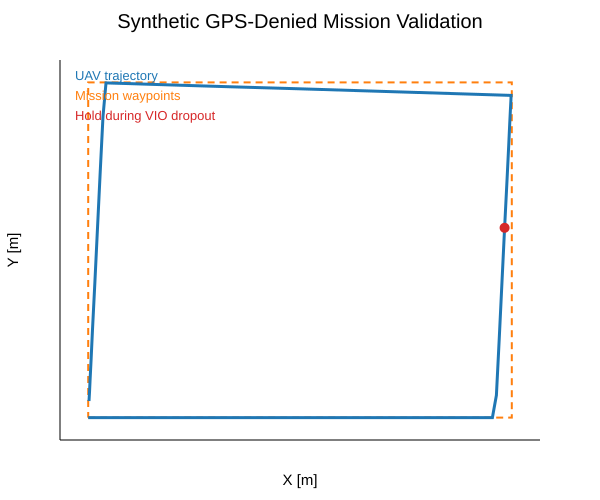
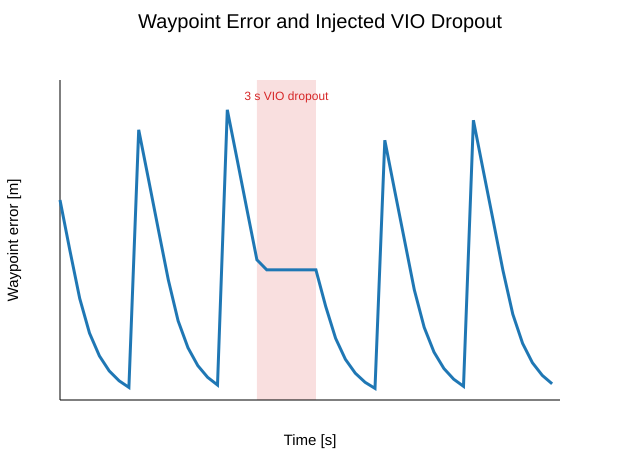

# GPS-Denied UAV Navigation with VIO (ROS 2)

A portfolio-oriented ROS 2 autonomy stack for GPS-denied multirotor navigation. The project is designed around an X500-class vehicle using visual-inertial odometry as the local pose source and a flight controller exposed through MAVROS-compatible topics/services.

> Scope note: this repository is intentionally independent of unpublished UAV target-tracking research. It focuses on localization health, waypoint navigation, failsafe behavior, and reproducible evaluation.

## Demo objective

The vehicle should:

1. take off without GPS,
2. consume VIO/local pose,
3. fly a waypoint mission,
4. detect degraded/stale localization,
5. hold safely during localization loss,
6. resume or abort according to configured policy,
7. log trajectory and localization-health metrics.

## Validation snapshot

The current software-level validation passes **10/10 unit tests** and completes a deterministic closed-loop waypoint mission with an intentionally injected **3-second VIO dropout**. During localization loss, the controller enters HOLD; navigation resumes after localization is restored.





See [`docs/VALIDATION.md`](docs/VALIDATION.md) for the test output, metrics, interpretation, and limitations.

## Architecture

```text
Camera + IMU
    |
    v
External VIO / SLAM
    |
    v
/vio/pose --------------------+
/vio/status                   |
                              v
                     Localization Monitor
                              |
                     /localization/health
                              |
                              v
Waypoint Mission ---> Mission Manager ---> Velocity Setpoint Controller
                                             |
                                             v
                                     /mavros/setpoint_velocity/cmd_vel
                                             |
                                             v
                                      PX4 / ArduPilot SITL
```

## ROS 2 package

`gps_denied_uav/` contains:

- `localization_monitor.py` — scores VIO freshness and jump consistency.
- `waypoint_controller.py` — pure control logic for position-to-velocity tracking.
- `mission_manager.py` — finite-state mission logic: WAIT_FOR_LOCALIZATION → TAKEOFF → NAVIGATE → HOLD/RECOVER → COMPLETE/ABORT.
- `mission_node.py` — ROS 2 node wiring pose, health, waypoint control, and velocity setpoints.
- `trajectory_logger.py` — CSV trajectory logging.
- `config/mission.yaml` — mission/failsafe parameters.
- `launch/gps_denied_mission.launch.py` — launch entry point.

## Evaluation

The repository includes tests and an experiment matrix for nominal missions, VIO dropouts, pose jumps, drift, and trajectory analysis. Simulation ground truth should be used to report VIO ATE/RMSE.

## Build

```bash
mkdir -p ~/gps_denied_ws/src
cd ~/gps_denied_ws/src
git clone https://github.com/sumangowdavr/gps-denied-uav-vio-navigation.git
cd ..
colcon build --symlink-install
source install/setup.bash
```

## Run tests

```bash
python3 -m pytest -q
```

Expected current result:

```text
..........                                                               [100%]
10 passed in 0.03s
```

## Run mission

```bash
ros2 launch gps_denied_uav gps_denied_mission.launch.py
```

## Safety

This is research and simulation code, not certified flight software. Validate frame conventions, flight-controller mode/arming interfaces, geofencing, watchdogs, and manual takeover in SITL/HITL before hardware use.
